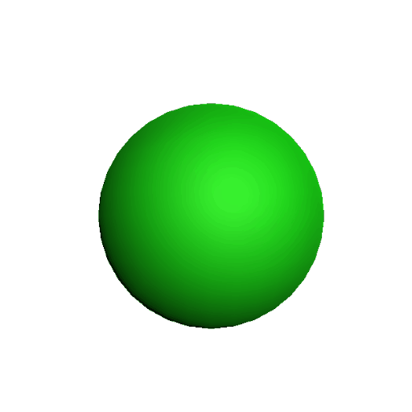
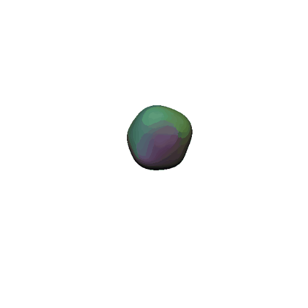
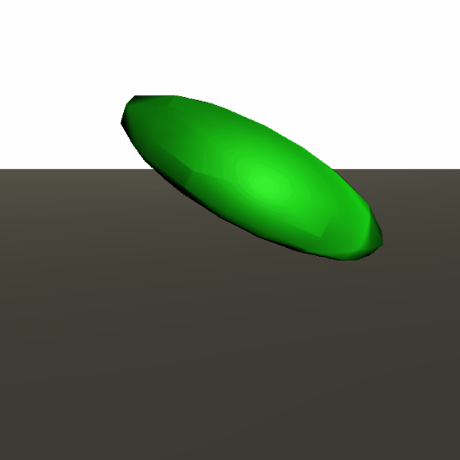

# Softbodies
Softbodies, jiggly items and other slimy stuff in Unity.

## Description

This is an exploration of an idea of making dynamic, jelly-like meshes. Those objects are always a nice addition to a interactive world.
Their responsiveness to our input and strange force that causes them to remain overall shape generates a weird fun that cannot be described in words.

Unity, the most popular game engine in the world right now, should provide us with good basis on how to render and handle our Softbodies.
However, this README has an information on how to make it regardless of engine, language you want to use.

## Basics of Meshes

Each mesh has a lot of data in it. In the simplest form, mesh consists of vertices (points in a space) and triangles (defined by those points).

Generating your own mesh isn't a hard task: just give it some points, tell which points generate triangle and *voilà*.

Mesh, that changes it's shape over time, should update it's vertices each frame, so the rendered object fits our data.

For example: 

    1. Create a water surface as a point grid.

    2. Create triangles, so each square of an grid consists of two triangles.

    3. Each point on the grid can be updated each frame with a function: y = sin(x + Time.deltaTime) in a shader or in some code.
       This creates simple 3D water waves.

If it's a vertex shader: job is done.

If we done it in a code (e.g. MonoBehaviour Unity) we should also update our current mesh with: ```mesh.vertices = waveVertices```

There are so many things you can do with vertices, triangles and meshes, but those basics and this idea of changing mesh is crucial in implementing a some sort of Jelly-like object.

## Softbody - Realtime Mesh Deformation

Modifying base vertex that is just ```float x, y, z;``` with velocity, initial position and current deformation position, can give an interesting results.
Adding some pressure/input, modifies all vertices by giving them some velocity based on distance from the "touch point". Touching a balloon makes a small hole and expands whole object in all directions as we reduced volume of an space inside the balloon.

Also, we should reduce velocity of each point each frame, and try to settle the points back onto their original positions.



This works pretty well with static object that can be touched and their shape doesn't change much. Also for optimization: this could be a good thing to use compute shaders as a lot of simple tasks can be done in parallel.

**Repository: Softbody - contains class of an single SoftVertex and Softbody that handles all SoftVertices making mesh fit with them.**

## Jellybody - Springs and the Mesh

The basic concept of all dynamic and jelly-like bodies is to use springs: connection between points that makes them remain their original distance. If we set those points at the vertices of a mesh, and make connections between each vertex pair... we could manipulate a mesh into behaving like a jelly. Then, those jelly vertices are mapped into mesh vertices, so mesh can be changed. Also those points should have some kind of mass to simulate physics with (Rigidbody in Unity). 


This solution is fairly simple but may be computationally expensive with complicated Meshes because of springs... With compute shaders this should work fairly fast.

There is one **big** problem with this: colliders.

Changing collider each frame can't be done for bigger meshes as it it too complex and mesh colliders are really slow compared to primitive shape (sphere) coliders. In 2D this shouldn't be a big problem, making Jellybody a good candidate for jellylike objects in 2D worlds. In my project I added a small colliders on each jelly vertex and a sphere collider inside. This should fake the lack of dynamic collider.

**Repository: Jellybody - contains class that creates vertices (and mesh-JellyVertex mapping for duplicate vertices) and springs. Also updates mesh. **

## Fluidbody - Springs and Raymarching

When I was playing with those objects, I also thought of using something different to generate meshes with. Spheres are really weird things and they look really... fluidy. Also to render them you don't need a mesh and that is useful. Sebastian Lague in his video: https://www.youtube.com/watch?v=Cp5WWtMoeKg, showed us all how Raymarching works and this is very good for the start for our next jelly-like object.

I used his code to generate spheres that blend together. Then, those spheres are connected to some point in a space. Of course: using springs.



Looks good, but Raymarching in Unity is not a fast way to render objects with droplet count bigger that 8. So it is completely unpractical. However, this is a good example of using our primary idea that all jellies are just springs in disguise.

**Repository: Fluidbody - contains class that instantiates Shapes and creates springs with the center point. **

## Skinned Mesh Renderer in Unity

Skinned Mesh Renderer is used for rendering rigged objects by modifying vertices according to their bone. This is useful if you have a character and you want to animate it using it's "skeleton". Nodding head can be reduced from animating whole mesh vertex by vertex to a simple rotation of a neckbone. Changeability of a mesh is crucial in our quest of getting a softbody.

If we took an rigged model, added some springs between bones, physics, we can achieve a somewhat dynamic body - responsive to external forces and constantly trying to remain it's own starting shape.  



Result? Pretty efficent softbody, especially for bigger models and doing some configuration and tweaking can make us a great jelly for a game. Simple solution that doesn't need much programming, but will be very good for rapid prototyping and testing. 

**Repository: Riggedbody - contains class that adds rigidbodies and springs between all given bones.**

## The Grand Finale

If you want to play with Softbodies: clone repository and use Unity to check how it works.

## Other ideas for Softbodies


https://www.youtube.com/watch?v=mCGVxMqHYUk

https://assetstore.unity.com/packages/tools/physics/obi-softbody-130029?aid=1011l34eQ&utm_source=aff
